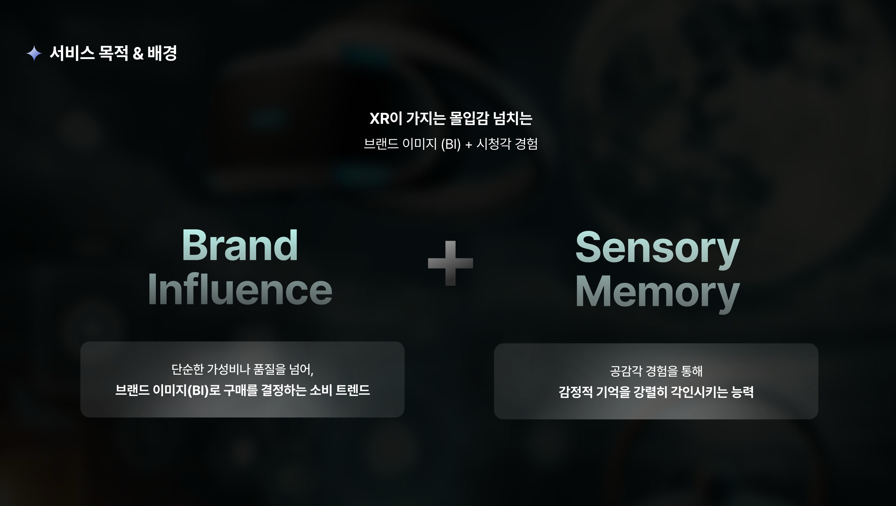
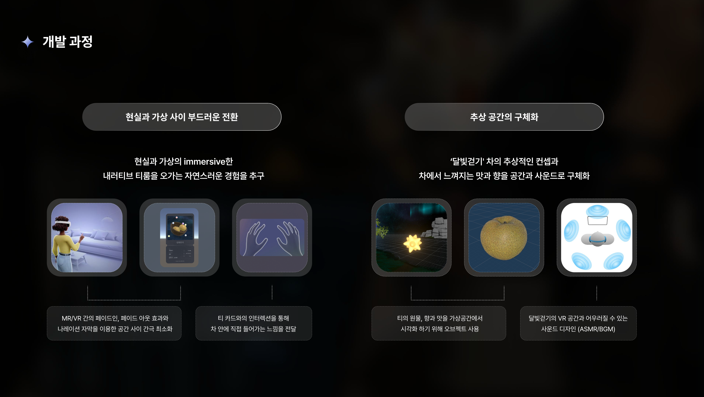

# 🌡 90Degreecelsius

> 혼합현실 기반 공감각적 티 체험 콘텐츠

---

## 🖼 

  

## 🖼 데모 미리보기

  

---

## 📌 프로젝트 개요

- **기간**: 2024.11.18 ~ 2024.12.03 (약 3주)
- **콘텐츠 유형**: XR 기반 몰입형 혼합현실(MR) 체험
- **대상 브랜드**: 오설록(OSULLOC) – ‘달빛 걷기’ 티 제품
- **진행 행사**: XREAL 학회 주관 **ReDevDe 프로젝트**

**90Degreecelsius**는 현실과 가상이 연결된 공간 안에서 차를 마시는 감각적 경험을 제공하는 **공감각(Synesthetic) 기반 XR 콘텐츠**입니다.  
사용자는 MR에서 시작하여 VR로 이어지는 몰입형 경험을 통해 오설록의 브랜드 이미지와 제품 스토리를 깊이 있게 느낄 수 있습니다.

---

## 🎯 개발 목적

- 🍵 오설록의 **‘달빛 걷기’ 티**를 XR 콘텐츠로 구현  
- 🌐 **MR과 VR 간의 자연스러운 전환**을 통해 몰입감 있는 사용자 경험 제공  
- 👁️‍🗨️ 브랜드의 이미지를 **시청각적 인터랙션**으로 전달  
- 🧠 **사용자 중심의 인터랙션 구성**으로 능동적 체험 유도  
- 🎧 **공간 오디오** 및 기술적 **최적화 기법**을 활용한 자연스러운 몰입 환경 구성  

---

## 🎨 서비스 목적 및 배경

  
  

---

## 🛠 개발 과정

  

---

## 🧭 체험 구성 단계

### 0단계 : 기본 설정
- Lazy Follow 기반 UI 구현 – 고개 방향을 따라 자연스럽게 지연되는 UI
- 자연스러운 Fade In/Out 자막 시스템
- Phase 간 전환 시 끊김 없는 Scene 이동 로직 구성

### 1단계 : 티 카드를 통해 차 이해하기
- `Mathf.Lerp`로 카드가 부드럽게 커지며 등장하고 작아지며 사라지는 효과 구현
- XR Interaction Toolkit의 Grab Interaction을 통해 티 카드 직접 조작
- Stencil Shader를 사용해 카드 속 이중 차원을 시각적으로 연출
- 카드와 사용자의 머리가 Trigger 충돌하면 다음 Phase로 자연스럽게 이동

### 2단계 : 차에 대한 상상 경험
- Passthrough 밝기/채도 조절을 통한 어두운 공간 전환
- BackgroundMusicManager(Singleton 구조)를 통해 BGM 제어
- 사운드 종료 시점에 Fade-Out으로 밝기 복원하며 다음 Phase로 전환

### 3단계 : 실제 차 시음 체험
- 사용자의 머리 회전 각도(Euler x축)를 Update + Mathf.Clamp로 감지
- 특정 각도 이하일 경우 시음 이벤트 실행: 화면 어두워지고 시음용 사운드 재생
- 사용자가 티 카드 뒷면을 응시하면 VR Scene으로 전환
- `SceneLoadAsync()` 사용으로 비동기 VR 씬 로딩 → 끊김 없는 전환

### 4단계 : 시·청각 기반의 공감각적 VR 공간 감상

  

- Overlay Passthrough 및 맵 오브젝트 페이드로 VR 환경 자연스럽게 활성화
- 고개 각도 15도 이하로 숙일 경우 현실로 되돌아가는 구조 → 몰입과 이탈을 시선으로 제어
- 별사탕 오브젝트 Grab Interaction → 잡으면 빛 효과 + 사운드 출력
- 최적화를 위해 Bake 조명, 안티앨리어싱, LOD, Update 최소화 등 적용

---

## 🔍 유저 테스트

  
  

---

## 🛠 사용 기술

| 기술 요소              | 설명                                |
|------------------------|-------------------------------------|
| Unity                  | 전체 콘텐츠 구현 플랫폼             |
| Meta XR SDK            | VR 인터랙션 및 패스스루 구현       |
| Stencil Shader         | 카드 내부의 차원 표현               |
| XR Interaction Toolkit | Grab/Trigger 기반 상호작용 구성    |
| SceneLoadAsync         | 씬 전환 시 끊김 없는 로딩           |
| AudioMixer, Spatial Audio | 고급 음향 제어 및 공간감 표현  |
| 최적화 기법            | LOD, Baked Light, Update 최소화 등 |

---

## 👩‍💻 팀 구성

### 🔍 Research
- 최윤서
- 강원빈
  
### 🔧 Dev
- 강가은
- 나우진
- 임채윤

### 🎨 Design
- 김다훈
- 박예지
- 박단비
- 조윤빈

---

## 📝 참고 사항

> 본 콘텐츠는 **XREAL 학회**의 **ReDevDe 행사**에서 기획 및 개발되었습니다.
